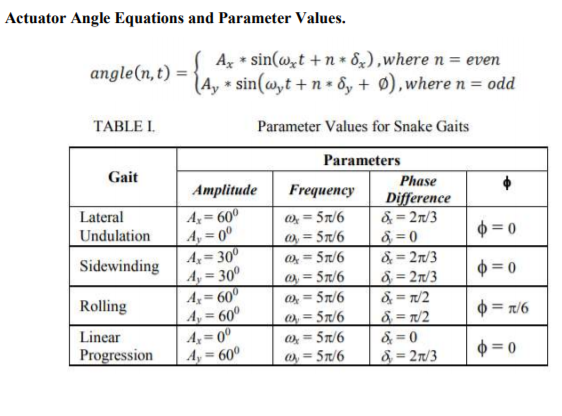

# Snake-Gaits
The project was aimed to understand DH parameters using snake gaits. 
To Model & simulate the basic snake kinematic model consisting of 10 links with vertical & horizontal actuators using DH parameterization.

### The gait eqautions are given by:

### Methodology
* Taking head as a zeroth link, preparing the DH parameter table for all the links.
* Finding all the DH transformation matrices.
* Finding co-ordinates of each actuator and vary the actuator angles as per given gait equations.
* Plotting the obtained coordinate arrays. 
### Refrences
* [DH Parameters](https://www.youtube.com/watch?v=rA9tm0gTln8)
* [ReBiS - Reconfigurable Bipedal Snake robot](https://ieeexplore.ieee.org/abstract/document/6942577)
